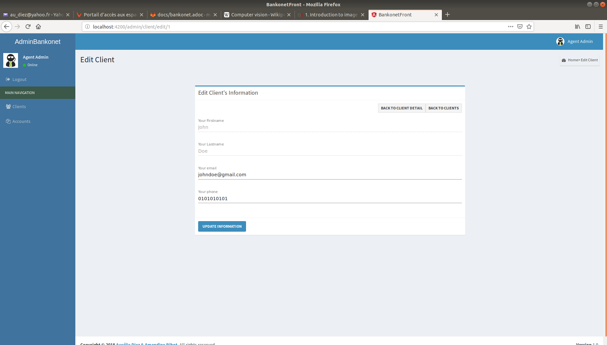
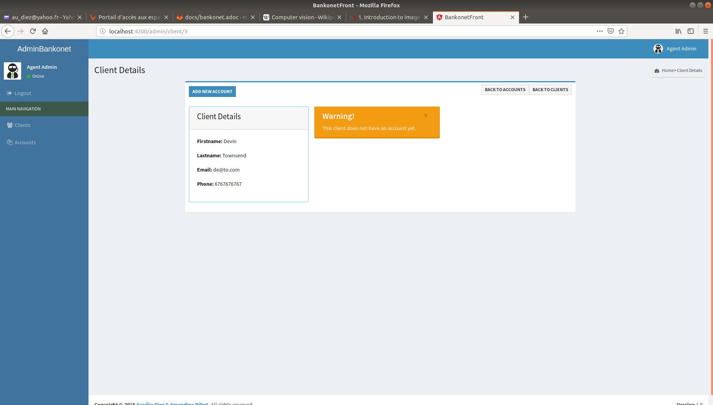

= Documentation de l'Application Bankonet

L'entreprise Bankonet veut commander une application Bancaire utilisant les technologies Angular pour le front et Spring Boot Java pour le back.

Cahier des charges: https://gitlab.bordeaux.sqli.com/formation-poe/cdc-bankonet/blob/master/cdc_bankonet.adoc

== Spécifications Fonctionnelles

Deux types d'utilisateurs peuvent utiliser cette application :

* Les agents de la Banque: partie administration
* Les clients de la Banque: partie utilisateur

=== Partie Administration: côté agent

Un agent se connectera à un espace spécifique, requièrant un login, pour :

* La gestion des clients et de leur comptes respectifs
* La gestion des comptes

https://gitlab.bordeaux.sqli.com/formation-poe/prj-bankonet/blob/master/doc/uml/bankonet-agent_use_case.puml[Sources]

Il pourra effectuer les actions suivantes :

* Obtenir la liste de ses clients, on affichera alors les informations suivantes (sous forme de tableau) :
** Id du client
** Nom du client
** Prénom du client
** Un bouton détail pour obtenir le reste des infos clients et sa liste de comptes
** Un bouton éditer pour changer les informations du client
** Un bouton supprimer pour supprimer le client

* Ajouter un client à la banque, il devra saisir les informations suivantes :
** Le nom du client
** Le prénom du client
** L'email du client au format xxx@xxx.xxx
** Le numéro de téléphone au format 9999999999

* Modifier les informations d'un client, seules les informations suivantes seront modifiables :
** Email
** Numéro de téléphone

* Supprimer un client
** On ne peut supprimer un client que s'il n'a plus aucun compte chez bankonet
--
NOTE: Supprimer un client, entrainera la suppression de tous ces comptes
--

* Pour un client donné il pourra alors
** Voir toutes les informations du client :
*** Nom
*** Prénom
*** Email
*** Téléphone
** Voir tous les comptes du client
*** Nom du compte
*** Type du compte
*** Balance du compte
*** Autres informations relatives au compte
** Voir un message d'information si le client ne possède aucun compte

** Ajouter des comptes au client :
*** Si le client ne possède aucun compte, un compte courant sera créé avec :
**** Libéllé du compte
**** Solde de départ qui doit être positif
**** Plafond de découvert autorisé

*** Si le client possède déjà un compte courant, un compte épargne sera créé avec :
**** Libéllé du compte
**** Solde minimum
**** Solde de départ qui doit supérieur ou égal au solde minimum
**** Le taux d'intérêt

--
NOTE: On ne peut ajouter un compte épargne que si le client possède déjà un compte courant
--

** Modifier certaines info du compte courant du client :
*** Libellé du compte
*** Plafond de découvert autorisé
--
NOTE: On ne peut pas saisir un plafond de découvert inférieur au découvert actuel du compte +
Le solde de départ est débité du compte courant (si l'état de ce dernier ne le permet pas le compte épargne ne sera pas créé)
--

** Modifier le compte épargne du client :
*** Libellé du compte
*** Taux d'intéret
*** Minimum requis

** Supprimer un compte épargne :
*** Le solde du compte épargne sera alors crédité sur le compte courant

image::images/maquettes/AdminDeleteSaving.png[]

** Supprimer le compte courant du client :
*** On ne peut supprimer son compte courant que s'il ne possède aucun compte épargne
*** On ne peut pas clôture un compte avec un solde négatif
--
NOTE: La suppression du compte courant, entraine la suppression du compte client
--

** Obtenir la liste de tous les comptes courants et épargnes de Bankonet, avec les informations suivantes :
*** Id du compte
*** Id du client
*** Status du compte
*** Un bouton détail pour voir le compte associé à son client
*** Un bouton éditer pour changer les informations du compte
*** Un bouton supprimer pour supprimer le compte

--
NOTE: Le status du compte dépend de la balance et du minimum requis ou du crédit autorisé.
Si la balance est supérieur, le status est 'bon', sinon le status est 'à surveiller'.
--

Les boutons détails, éditer et supprimer renvoit aux mêmes pages que précédemment.

=== Partie utilisateur: côté client

Le client se connectera à un espace spécifique permettant :

* La gestion de ses informations
* La gestion de ses comptes
* Le transfer d'argent

https://gitlab.bordeaux.sqli.com/formation-poe/prj-bankonet/blob/master/doc/uml/bankonet-client_use_case.puml[Sources]

Il pourra donc effectuer les actions suivantes :

* Voir ses informations personnelles :
** Nom
** Prénom
** Son email au format xxx@xxx.xxx
** Son numéro de téléphone au format 9999999999

* Modifier ses informations personnelles :
** Son email au format xxx@xxx.xxx
** Son numéro de téléphone au format 9999999999

* Lister l'ensemble de ses comptes sous forme de liste (on affichera en premier son compte courant)
** Type de compte (Courant / Epargne)
** Id du compte
** Libellé du compte
** Solde du compte
** Graphiques de répartition

* Pour chaque compte il pourra
** Visualiser le détail de son compte suivant son type
*** Compte Courant :
**** Id du compte
**** Libéllé du compte
**** Solde
**** Plafond de découvert autorisé

*** Compte Epargne :
**** Id du compte
**** Libéllé du compte
**** Solde
**** Solde minimum
**** Taux d'intérêt
**** Bouton Cloture le compte 

--
NOTE: La balance restante sera créditer au compte courant.
--

* Pour chaque compte il pourra:
** Créditer son compte :
*** Le montant saisie doit être positif
*** Le montant sera alors ajouté au compte du client

image::images/maquettes/Client_CreditAccount.png[]

** Débiter son compte :
*** Le montant saisie doit être positif
*** Dans le cas de son compte courant le solde après opération doit être supérieur au plafond de découvert autorisé
*** Dans le cas d'un compte épargne le solde après opération doit être supérieur au solde minimum
*** Le montant sera alors débité de son compte

* Effectuer un virement depuis un de son compte :
*** Il pourra alors choisir comme destinataire :
**** Un autre de ses comptes

**** Le compte courant d'un autre client

*** Le montant saisie doit être positif
*** Dans le cas de son compte courant le solde après opération doit être supérieur au plafond de découvert autorisé
*** Dans le cas d'un compte épargne le solde après opération doit être supérieur au solde minimum
** Clôturer un de ses comptes épargne :
*** Le solde de ce compte sera alors transféré sur son compte courant

== Architecture Applicative

L'application s'appuiera sur les principes du MVC Client :

* Un Front en Angular s'occupant de la présentation appelera
* Un Back en Spring Boot :
** La couche controlleur exposera des API REST / JSON et délèguera à
** La couche service les traitements métiers qui s'appuiera sur
** Le framework Hibernate pour la persistances
* Une Base de données MySQL qui stocker les informations
** Clients
** Comptes Courant
** Comptes Épargnes

https://gitlab.bordeaux.sqli.com/formation-poe/prj-bankonet/blob/master/doc/uml/bankonet-dat.puml[sources]

En terme de stack techniques nous aurons donc :

* Angular 6 : Pour la partie Front
* Spring Boot 2 : Starter de l'application Back (https://start.spring.io/)
** Spring MVC : Exposition d'API REST
** Hibernate : Pour la persistance
** Driver MySQL : Driver de base de données
** Spring Actuator : Monitoring
** Lombok : Pour la génération des DataBeans
** Rest Docs ou Swagger : Pour la documentation d'API

== Conception Technique Détaillée

=== La Base de données

Le modèle de la base de données s'appuiera sur trois tables distinctes :

* client : contiendra les informations sur les clients
* spending_account : contiendra les informations sur les comptes courants des clients
* saving_account : contiendra les informations sur les comptes épargnes des clients

image::images/bankonet_db1.png[]

https://gitlab.bordeaux.sqli.com/formation-poe/prj-bankonet/blob/master/back/scripts/bankonet_db1.sql[Sources]

Contraintes particulières :

* client :
** id : est la clé primaire, elle est auto incrémentée, non nulle et unique

* spending_account :
** spending_id : est la clé primaire, elle est auto incrémentée, non nulle et unique
** client_id : est une référence (clé étrangère) vers client.id. Ceci empèche de supprimer un client s'il possède un compte courant
** client_id : de plus cette clé est unique dans la table, ce qui interdit à un client de posséder plusieurs comptes courants

* saving_account :
** saving_id : est la clé primaire, elle est auto incrémentée, non nulle et unique
** client_id : est une référence (clé étrangère) vers client.id. Ceci empèche de supprimer un client s'il possède un compte épargne

=== Back Spring Boot

==== APIs Exposées

*Cas d'utilisation Gestion Clients*

* GET /api/v1/client/list : Lister les clients de bankonet
** @return : List<Client> => [{"id":1,"lastname":"Doe","firstname":"John","email":"johndoe@gmail.com","phone":"0101010101"},{"id":2,"lastname":"Doe","firstname":"Jane","email":"janedoe@gmail.com","phone":"0202020202"}]
* GET /api/v1/client/{id} : Récupérer le client {id}
** @return : Client => {"id":1,"lastname":"Doe","firstname":"John","email":"johndoe@gmail.com","phone":"0101010101"}
* POST /api/v1/client/save : Créer un nouveau client
** @requestBody : Client => {"lastame":"Michel","firstname":"Jean","email":"jeanmichel@gmail.com","phone":"0303030303"}
** @return : 200
* POST /api/v1/client/update/{id} : Modifier le client {id}
** @requestBody : Client => {"3", "lastname":"Michel","firstname":"Jean","email":"jeanmichel@gmail.com","phone":"0404040404"}
** @return : 200
* DELETE /api/v1/client/remove/{id} : Supprimer le client {id}
** @return : 200

*Cas d'utilisation Gestion Comptes Courant*

* GET /api/v1/account/spending/list : Lister tous les comptes courant
** @return : List<SpendingAccount> => [{"id":1,"name":"spending","amount":"100","credit":"20","clientId":"1"},{"id":2,"name":"income","amount":"2000","credit":"50","clientId":"2"}]
* GET /api/v1/account/spending/list/client/{id} : Récupérer le compte courant du client {id}
** @return : SpendingAccount => {"id":1,"name":"spending","amount":"100","credit":"20","clientId":"1"}
* GET /api/v1/account/spending/{id} : Récupérer le compte courant {id}
** @return : SpendingAccount => {"id":1,"name":"spending","amount":"100","credit":"20","clientId":"1"}
* POST /api/v1/account/spending/save : Créer un compte courant
** @requestBody : SpendingAccount => {"id":3,"name":"mymoney","amount":"1000","credit":"90","clientId":"3"}
** @return : 200
* POST /api/v1/account/spending/update/{id} : Modifier le compte courant {id}
** @requestBody : SpendingAccount => {"id":3,"name":"mymoney","amount":"10000","credit":"90","clientId":"3"}
** @return : 200
* DELETE /api/v1/account/spending/remove/{id} : Supprimer le compte courant {id}
** @return : 200
* DELETE /api/v1/account/spending/remove/client/{id} : Supprimer le compte courant du client {id}
** @return : 200

*Cas d'utilisation Gestion Comptes Épargne*

* GET /api/v1/account/saving/list : Lister tous les comptes épargnes
** @return : List<SavingAccount> => [{"id":1,"name":"saving","amount":"500","minimum":"50", "interest":"0.4", clientId":"1"},{"id":2,"name":"put_aside","amount":"2000","minimum":"20", "interest":"1.4","clientId":"2"},{"id":3,"name":"put_aside2","amount":"20000","minimum":"20", "interest":"3.4","clientId":"2"}]
* GET /api/v1/account/saving/list/client/{id} : Récupérer les comptes épargnes du client {id}
** @return : List<SavingAccount> => [{"id":2,"name":"put_aside","amount":"2000","minimum":"20", "interest":"1.4","clientId":"2"},{"id":3,"name":"put_aside2","amount":"20000","minimum":"20", "interest":"3.4","clientId":"2"}]
* GET /api/v1/account/saving/{id} : Récupérer le compte épargne {id}
** @return : SavingAccount => {"id":2,"name":"put_aside","amount":"2000","minimum":"20", "interest":"1.4","clientId":"2"}
* POST /api/v1/account/saving/save : Créer un compte épargne
** @requestBody : SavingAccount => {"id":4,"name":"saving","amount":"200","minimum":"20", "interest":"0.4","clientId":"3"}
** @return : 200
* POST /api/v1/account/saving/update/{id} : Modifier le compte épargne {id}
** @requestBody : SavingAccount => {"id":2,"name":"put_aside","amount":"2000","minimum":"20", "interest":"2.4","clientId":"2"}
** @return : 200
* DELETE /api/v1/account/saving/remove/{id} : Supprimer le compte épargne {id}
** @return : 200
* DELETE /api/v1/account/saving/remove/client/{id} : Supprimer le compte épargne du client {id}
** @return : 200

==== Différentes Couches Back

https://gitlab.bordeaux.sqli.com/formation-poe/prj-bankonet/blob/master/doc/uml/banckonet-class_diagram.puml[Sources]

=== Front Angular

==== Espace Agent

L'agent se sonnecte à son espace réservé afin de pouvoir gérer les clients et leurs comptes, ainsi que l'ensemble des comptes de la banque.

https://gitlab.bordeaux.sqli.com/formation-poe/prj-bankonet/blob/master/doc/uml/espace_agent-activity_diagram.puml[Sources]

==== Espace Client

Le client se connecte à son espace réservé pour pouvoir gérer ses informations, ses comptes et pouvoir effectuer des tranferts.

https://gitlab.bordeaux.sqli.com/formation-poe/prj-bankonet/blob/master/doc/uml/espace_client-activity_diagram.puml[Sources]

==== Achitecture du projet côté Angular

* SRC
       ** assets
	      *** css
          *** image
       ** environments
       ** app
	        ** admin
              *** admin-components
                 **** account-create
                 **** account-edit-details
                 **** account-list
                 **** client-create
                 **** client-detail
                 **** client-edit-details
                 **** client-list
                 **** footer
                 **** login
                 **** navbar

	        ** client
	           *** client-components
                **** accounts-details
                **** account-list
                **** footer
                **** home
                **** login
                **** manage-balance
                **** manage-transfer
                **** navbar
                **** profil-page
                **** profil-page-edit
                **** transfer
    
            ** model
                  *** account
                  *** client

           ** service
                *** account.service
                *** client.service

           ** shared
           ** tests

==== Routes partie Angular   

(Partie utilisateur : côté client)

* client-routes
		
			{
				path: ‘’,
				component: HomeComponent
			},
			{
				path: ‘login’,
				component: LoginComponent
			},
			{
				path: ‘account/list/:id,
				component: AccountListComponent
			},
			{
				path: ‘accout/details/:type/:id’,
				component: AccountDetailsComponent
			},
			{
				path: ‘profile/:id’,
				component: ProfilPageComponent
			},
			{
				path: ‘profile/edit/:id’,
				component: ProfilPageEditComponent
			},
			{
				path: ‘transfer/:id’,
				component: TransfertComponent
			}

(Partie administrateur : côté agent)

* admin-routes

			{
				path: ‘’,
				component: LoginComponent
			},
			{
				path: ‘client/list’,
				component: ClientListComponent
			},
			{
				path: ‘client/create’,
				component: ClientCreateComponent
			},
			{
				path: ‘client/:id’
				component: ClientDetailComponent
			},
			{
				path: ‘client/edit/:id’,
				component: ClientEditDetailsComponent
			},
			{
				path: ‘account/list’,
				component: AccountListComponent
			},
			{
				path: ‘account/create/:type/:id’,
				component: AccountCreateComponent
			},
			{
				path: ‘account/edit/:type/:id’,
				component: AccountEditDetailsComponent
			}

